# Hey, I'm Oli!

I'm a Swedish student who loves tinkering with code and learning new things.  
I experiment with all sorts of bits and bobs! Which typically involves a "healthy" amount of programming.  
My recent obsession has been with **calendars** for which I've made [a few projects](https://github.com/stars/olillin/lists/calendars) from libraries and utilities to full websites.  

## Here's some of the things I've done

🌐 Full-stack website and API development using [NextJS](https://nextjs.org), [TypeScript](https://www.typescriptlang.org) and [Express](https://expressjs.com).  

- [Cal's Cals](https://github.com/olillin/cals-cals)
- [Strecklista Backend](https://github.com/olillin/strecklista-backend)
- [Spill the Tea](https://github.com/cthit/spill-the-tea)
- [TimeSend](https://github.com/olillin/timesend)

📚 npm libraries for various purposes.

- [iamcal](https://github.com/olillin/iamcal)
- [gammait](https://github.com/olillin/gammait)
- [chalmers-search-exam](https://github.com/olillin/chalmers-search-exam)

🤖 Discord bots in TypeScript with [Node.js](https://nodejs.org).  

- [P.R.I.T. Bot](https://github.com/olillin/prit-bot)
- [Pingu Bot](https://github.com/olillin/pingu-bot)

🌳 Minecraft mod and plugin development in [Kotlin](https://kotlinlang.org) (prev. Java).  

- [Bonk](https://github.com/olillin/bonk)

🐍 Utility programs in [Python](https://www.python.org).  

- [lazyclone](https://github.com/olillin/lazyclone)
- [Git Repo Checker](https://github.com/olillin/repochecker)

🐧 Server administration with [NixOS](https://nixos.org), [Docker](https://docker.com) and [Arion](https://github.com/hercules-ci/arion) (prev. [Ubuntu Server](https://ubuntu.com/download/server)).  

## Software?

❄️ For the past year I've been running [NixOS](https://nixos.org) and really enjoyed the experience!  
🖊️ My usual editor is [Neovim](https://neovim.io), although my config leaves much to be desired. I occassionally use [IntelliJ IDEA](https://www.jetbrains.com/idea) when programming in Kotlin or Java.  
📂 The file explorer I use is [Yazi](https://yazi-rs.github.io) with *most* plugins installed.  
🎨 I use [GIMP](https://www.gimp.org) for anything image-related.  

## Links

🌐 [Website](https://olillin.com)  
💚 [Modrinth](https://modrinth.com/user/olillin)  
🧩 [Repology](https://repology.org/maintainer/oli%40olillin.com)  
📦 [npmx](https://npmx.dev/~olillin)  
🐍 [PyPI](https://pypi.org/user/OliTheHoodieBoi)  

## Stats

